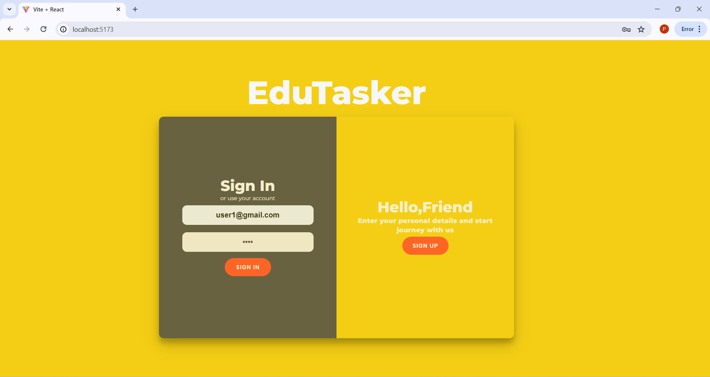
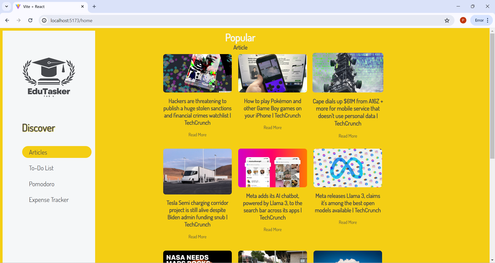
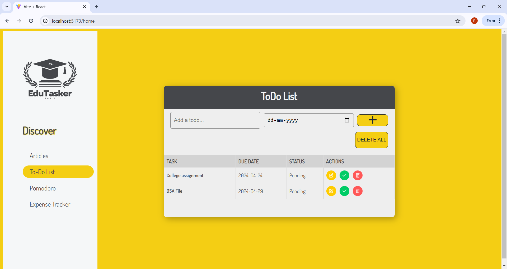
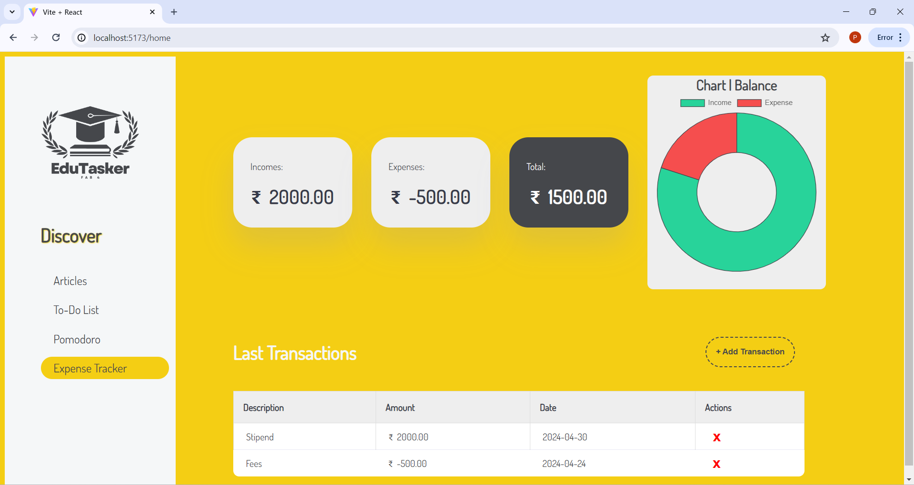

---

# EduTasker - StudyPods v4.0

## Team FAB 4 - SP0413

### Team Members:
- Yuvraj Singh
- Prateek Dave
- Vishnu Jangid
- Sidharth Joshi

---

## Overview:
EduTasker is a full-stack MERN project developed by Team FAB 4 for StudyPods v4.0. It is designed to enhance productivity and organization for students and learners. The project includes several features to facilitate learning and task management.

---

## Features:
1. **Insightful Articles:** Daily new articles to keep users informed and engaged.
2. **Todo List:** Organize tasks and track progress efficiently.
3. **Pomodoro Timer:** Improve focus and productivity with timed work sessions and breaks.
4. **Expense Tracker:** Visualize spending patterns with a doughnut graph for better financial management.
5. **Authentication:** Secure sign-up and sign-in options for user accounts.

---

## Technologies Used:
- MongoDB: Database for storing user data and task information.
- Express.js: Backend framework for handling server-side logic.
- React.js: Frontend library for building interactive user interfaces.
- Node.js: Server-side JavaScript runtime environment.

---

## Installation:
1. Clone the repository to your local machine.
2. Navigate to the frontend folder and run `npm install` to install frontend dependencies.
3. Navigate to the backend folder and run `npm install` to install backend dependencies.
4. Run `npm run dev` in frontend folder to start the frontend development server.
5. Run `nodemon server.js` in backend folder to start the backend development server.

---

## Usage:
1. Sign up for a new account or sign in with existing credentials.
2. Explore insightful articles, add tasks to the todo list, and use the pomodoro timer for focused work sessions.
3. Track expenses and view spending patterns with the doughnut graph.
4. Enjoy a streamlined and productive learning experience with EduTasker.

---
## Screenshots

### Login

### Dashboard

### Todo List

### Pomodoro Timer

### Expense Tracker

